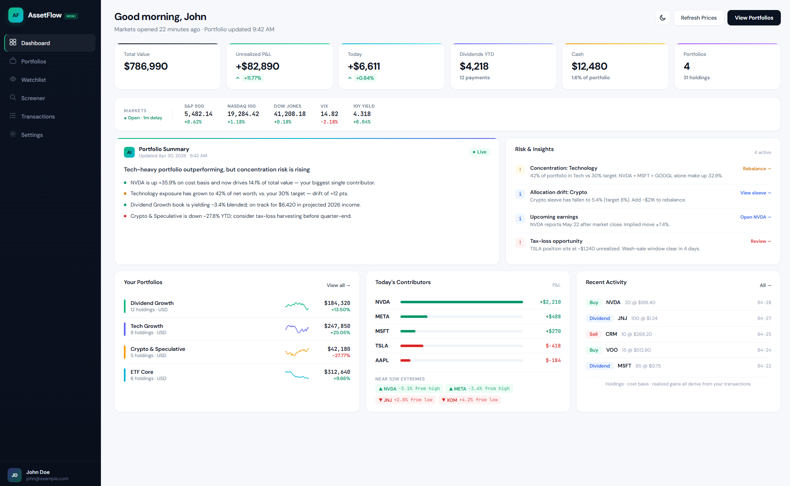
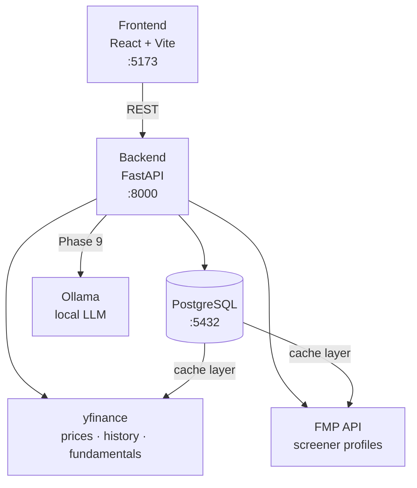

# AssetFlow Mini


A full-stack portfolio management and research platform with quantitative analytics and local AI-assisted insights — built as both a personal finance tool and a technical showcase.

The frontend is a multi-screen fintech application: candlestick charts with multiple timeframes and modes, a fundamentals grid, an AI score ring, a stock screener, portfolio performance charts, and sector allocation breakdowns. The backend is a FastAPI service backed by PostgreSQL, with live market data and fundamentals via yfinance (DB-cached), FMP for screener profiles, and a full quantitative analytics layer (Sharpe ratio, VaR, Monte Carlo simulation, Efficient Frontier, planned). AI narrative summaries will run locally via Ollama — no third-party LLM calls, no data leaves the machine.

**Status:** Active development — Phase 6 complete (screener, fundamentals, and news live). Phase 7–8 (quant analytics) is next.

---

## Screenshot



---

## Architecture



All external API responses (prices, news, screener) are cached in a `market_data_cache` table with per-type TTLs. If the external API is down, stale cache is returned with a `"stale": true` flag rather than an error.

---

## Features

### Live (Phases 1–5)

**Dashboard**
- Multi-portfolio KPI cards: total value, cost basis, unrealised P&L, daily change
- Sector and country allocation donut charts
- Top holdings breakdown with sparklines and mini bar charts
- Dividend forecast and target vs. actual allocation view

**Portfolio Detail**
- Holdings table: shares, average buy price, current price, market value, daily %, unrealised %, allocation weight
- Performance line chart with 5 timeframes (1M / 3M / 6M / 1Y / All)
- Sector allocation breakdown
- AI narrative summary card with headline and per-bullet sentiment tones (good / watch)
- Recent transactions sidebar with one-click add

**Ticker Detail**
- Candlestick chart with 3 modes (Candle / Line / Area) and per-mode timeframe switching (30m → 1M for candles; 1W → Max for line)
- 52-week high/low overlay and distance-from-high indicator
- Key statistics grid: market cap, P/E, EPS, beta, 52W range, dividend yield, revenue growth
- Fundamentals grid: revenue, net income, FCF, ROE, gross margin, operating margin, net margin, D/E
- AI score ring (0–100) with five dimensions: Growth, Profitability, Momentum, Value, Risk
- 12-month analyst price target with upside %
- News feed with per-item sentiment badges
- Your position card: market value, unrealised gain, shares, avg buy, cost basis, portfolio weight

**Screener**
- Filterable by sector and market cap tier
- AI quality score column per ticker
- Click-through to Ticker Detail from any row

**Transactions**
- Full transaction history (buy / sell)
- Manual entry with validation via backend API

**Market Data (Phase 5)**
- Live quotes and OHLCV history via yfinance
- DB-backed cache with TTLs: 5 min for quotes, 1 hr for history
- Stale-cache fallback with `"stale": true` flag if the upstream API is down
- Dashboard and Transactions screens wired to live backend data

**Other**
- Watchlist screen
- Settings screen
- Light / dark theme toggle across all screens

---

### Planned

**Phase 6 — News and screener** ✅
- Stock screener wired with live P/E, revenue growth, 6M performance (FMP profiles + yfinance)
- Live fundamentals endpoint (`/api/fundamentals/{symbol}`) — yfinance `.info`, 24h cache
- Three live news tabs: global macro (yfinance macro instruments: TNX, gold, oil, FX, VIX), portfolio news, ticker news
- Ticker news relevance filter (`_is_relevant()`) to remove off-topic articles
- 15-minute news cache

**Phase 7–8 — Quantitative analytics**
- Portfolio Detail: Sharpe ratio, annualised volatility, max drawdown, beta, correlation matrix heatmap
- Dedicated Analytics screen: Monte Carlo simulation (projection + confidence intervals), Efficient Frontier / mean-variance optimisation (Markowitz), Value at Risk (95%)
- Full statistical test coverage for all quant calculations

**Phase 9 — Local AI**
- Narrative summaries via Ollama (`llama3.2`) running fully locally
- Summaries grounded in backend-provided data — model cannot invent prices, metrics, or ratings
- Replaces the mocked AI summary cards already wired into the UI

**Later**
- CSV transaction import
- Wire remaining screens (Ticker Detail, Screener, Portfolio Detail) to live backend data

---

## Stack

| Layer | Tech |
|---|---|
| Frontend | React 18, Vite, JSX |
| Backend | FastAPI, Python 3.11+, uv |
| Database | PostgreSQL 16 (Docker) |
| ORM / Migrations | SQLAlchemy 2.0, Alembic |
| Data | yfinance (prices, history, fundamentals, news), FMP stable API (screener profiles) |
| AI | Ollama (local, Phase 9) |
| Testing | pytest, httpx |

---

## Project structure

```
assetflow-mini/
├── backend/
│   ├── app/
│   │   ├── api/            # Route handlers — thin, delegate to services
│   │   ├── core/           # DB session, config
│   │   ├── models/         # SQLAlchemy models
│   │   ├── schemas/        # Pydantic request/response models
│   │   ├── services/       # Business and calculation logic
│   │   └── scripts/        # Seed scripts
│   ├── tests/
│   └── pyproject.toml
├── frontend/
│   └── src/
│       ├── screens/        # Page-level components
│       ├── components.jsx  # Shared UI components
│       └── lib/api.js      # Centralized API calls (single source of truth)
└── docker-compose.yml
```

---

## Prerequisites

- Python 3.11+
- [uv](https://docs.astral.sh/uv/) — fast Python package manager (do not use pip)
- Node.js 18+
- Docker (for PostgreSQL)

---

## Getting started

### 1. Start the database

```bash
docker compose up -d
```

### 2. Set up the backend

Copy the example env file at the repo root and fill in your values:

```bash
cp .env.example .env
```

Then install backend dependencies:

```bash
cd backend
uv sync
```

Run migrations and seed sample data:

```bash
uv run alembic upgrade head
uv run python -m app.scripts.seed
```

### 3. Start the backend

```bash
cd backend
uv run uvicorn app.main:app --reload
```

API available at `http://localhost:8000` — interactive docs at `http://localhost:8000/docs`.

### 4. Start the frontend

```bash
cd frontend
npm install
npm run dev
```

Frontend available at `http://localhost:5173`.

---

## API endpoints

| Method | Path | Description |
|---|---|---|
| `GET` | `/health` | Health check |
| `GET` | `/api/portfolio/summary` | Portfolio summary with holdings and allocations |
| `GET` | `/api/transactions` | List transactions (optional `?portfolio_id=` filter) |
| `POST` | `/api/transactions` | Record a buy or sell transaction |
| `DELETE` | `/api/transactions/{id}` | Delete a transaction |
| `GET` | `/api/market/quote/{symbol}` | Live quote (DB-cached, 5 min TTL) |
| `GET` | `/api/market/history/{symbol}` | OHLCV bars (DB-cached, 1 hr TTL) — `?period=1mo\|3mo\|6mo\|1y\|2y\|5y` |
| `GET` | `/api/fundamentals/{symbol}` | Key stats + financials (yfinance, DB-cached, 24h TTL) |
| `GET` | `/api/news/ticker/{symbol}` | Ticker news with relevance filter (DB-cached, 15 min TTL) |
| `GET` | `/api/news/portfolio` | Portfolio-wide news (DB-cached, 15 min TTL) |
| `GET` | `/api/news/macro` | Global macro news via yfinance macro instruments (DB-cached, 15 min TTL) |
| `GET` | `/api/screener` | Stock screener with P/E, rev growth, 6M perf (DB-cached, 1 hr TTL) |

---

## Running tests

```bash
cd backend
uv run pytest
```

---

## Roadmap

| Phase | Feature | Status |
|---|---|---|
| 1 | Frontend design | Done |
| 2 | FastAPI backend foundation | Done |
| 3 | PostgreSQL + SQLAlchemy + Alembic | Done |
| 4 | Manual transaction entry | Done |
| 5 | Live market data via yfinance | Done |
| 6 | Stock screener + news + fundamentals | Done |
| 7–8 | Quant analytics (Sharpe, VaR, Monte Carlo, Efficient Frontier) | Planned |
| 9 | Local AI summaries via Ollama | Planned |

---

## Engineering notes

- **Package management:** `uv` throughout — no pip
- **Commits:** [Conventional Commits](https://www.conventionalcommits.org/) — `feat`, `fix`, `test`, `chore`, `refactor`, `docs`
- **Branch flow:** `feature/...` → PR → `dev` → PR → `main`
- **Architecture decisions:** documented as ADRs in `docs/decisions/`
- **Caching:** DB-backed cache table with per-type TTLs (5 min quotes · 1 hr history · 24 hr fundamentals · 15 min news)
- **No real trading:** local analysis only — no broker APIs, no order execution
