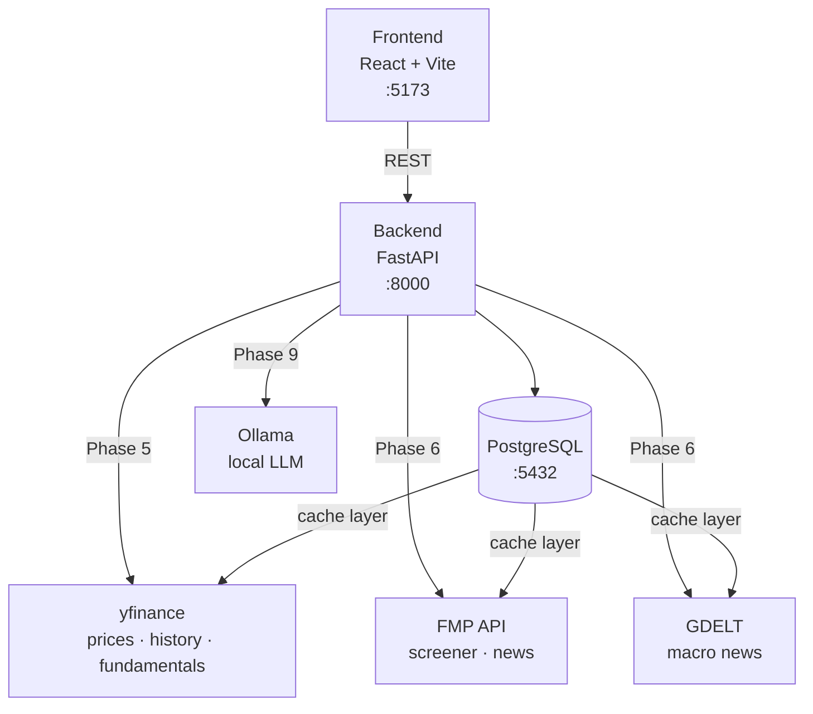

# AssetFlow Mini


A full-stack portfolio dashboard with quantitative analytics and local AI-assisted insights — built as both a personal finance tool and a technical showcase.

The analytics layer targets real quantitative methods: Sharpe ratio, Value at Risk, Monte Carlo simulation, and Markowitz mean-variance optimization (Efficient Frontier). Market data is cached in PostgreSQL with per-type TTLs to avoid redundant external API calls. AI summaries run locally via Ollama — no third-party LLM calls, no data leaves the machine.

**Status:** Active development — Phase 4 complete (transaction entry). Phase 5 (live market data) is next.

---

## Screenshot

<!-- Add a screenshot of the dashboard here once the app is running -->

---

## Architecture



All external API responses (prices, news, screener) are cached in a `market_data_cache` table with per-type TTLs. If the external API is down, stale cache is returned with a `"stale": true` flag rather than an error.

---

## What it does

**Live (Phases 1–4)**
- Multi-portfolio overview with total value, cost basis, unrealised P&L, and daily change
- Sector and country allocation breakdowns
- Manual transaction entry (buy / sell) with validation
- Interactive UI: dashboard, portfolio detail, watchlist, screener, transactions, ticker detail

**Planned**
- Live prices and OHLCV history via yfinance with DB-backed caching
- Stock screener via FMP free tier
- Three news tabs: global macro (GDELT), portfolio news, ticker news (FMP)
- Quant analytics: Sharpe ratio, annualised volatility, max drawdown, beta, VaR (95%), Monte Carlo simulation, Efficient Frontier
- Local AI narrative summaries via Ollama (`llama3.2`) — grounded in backend data, no invented numbers

---

## Stack

| Layer | Tech |
|---|---|
| Frontend | React 18, Vite, JSX |
| Backend | FastAPI, Python 3.11+, uv |
| Database | PostgreSQL 16 (Docker) |
| ORM / Migrations | SQLAlchemy 2.0, Alembic |
| Data | yfinance, FMP (free tier), GDELT |
| AI | Ollama (local, Phase 9) |
| Testing | pytest, httpx |

---

## Project structure

```
assetflow-mini/
├── backend/
│   ├── app/
│   │   ├── api/            # Route handlers — thin, delegate to services
│   │   ├── core/           # DB session, config
│   │   ├── models/         # SQLAlchemy models
│   │   ├── schemas/        # Pydantic request/response models
│   │   ├── services/       # Business and calculation logic
│   │   └── scripts/        # Seed scripts
│   ├── tests/
│   └── pyproject.toml
├── frontend/
│   └── src/
│       ├── screens/        # Page-level components
│       ├── components.jsx  # Shared UI components
│       └── lib/api.js      # Centralized API calls (single source of truth)
└── docker-compose.yml
```

---

## Prerequisites

- Python 3.11+
- [uv](https://docs.astral.sh/uv/) — fast Python package manager (do not use pip)
- Node.js 18+
- Docker (for PostgreSQL)

---

## Getting started

### 1. Start the database

```bash
docker compose up -d
```

### 2. Set up the backend

```bash
cd backend
uv sync
```

Copy the example env file and fill in your values:

```bash
cp .env.example .env
```

Run migrations and seed sample data:

```bash
uv run alembic upgrade head
uv run python -m app.scripts.seed
```

### 3. Start the backend

```bash
cd backend
uv run uvicorn app.main:app --reload
```

API available at `http://localhost:8000` — interactive docs at `http://localhost:8000/docs`.

### 4. Start the frontend

```bash
cd frontend
npm install
npm run dev
```

Frontend available at `http://localhost:5173`.

---

## API endpoints

| Method | Path | Description |
|---|---|---|
| `GET` | `/health` | Health check |
| `GET` | `/api/portfolio/summary` | Portfolio summary with holdings and allocations |
| `GET` | `/api/transactions` | List transactions (optional `?portfolio_id=` filter) |
| `POST` | `/api/transactions` | Record a buy or sell transaction |
| `DELETE` | `/api/transactions/{id}` | Delete a transaction |

---

## Running tests

```bash
cd backend
uv run pytest
```

---

## Roadmap

| Phase | Feature | Status |
|---|---|---|
| 1 | Frontend design | Done |
| 2 | FastAPI backend foundation | Done |
| 3 | PostgreSQL + SQLAlchemy + Alembic | Done |
| 4 | Manual transaction entry | Done |
| 5 | Live market data via yfinance | Next |
| 6 | Stock screener + news (FMP, GDELT) | Planned |
| 7–8 | Quant analytics (Sharpe, VaR, Monte Carlo, Efficient Frontier) | Planned |
| 9 | Local AI summaries via Ollama | Planned |

---

## Engineering notes

- **Package management:** `uv` throughout — no pip
- **Commits:** [Conventional Commits](https://www.conventionalcommits.org/) — `feat`, `fix`, `test`, `chore`, `refactor`, `docs`
- **Branch flow:** `feature/...` → PR → `dev` → PR → `main`
- **Architecture decisions:** documented as ADRs in `docs/decisions/`
- **Caching:** DB-backed cache table with per-type TTLs (5 min quotes · 1 hr history · 24 hr fundamentals · 15 min news)
- **No real trading:** local analysis only — no broker APIs, no order execution
