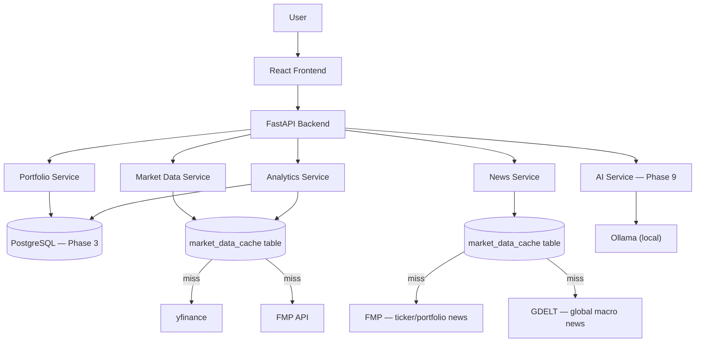
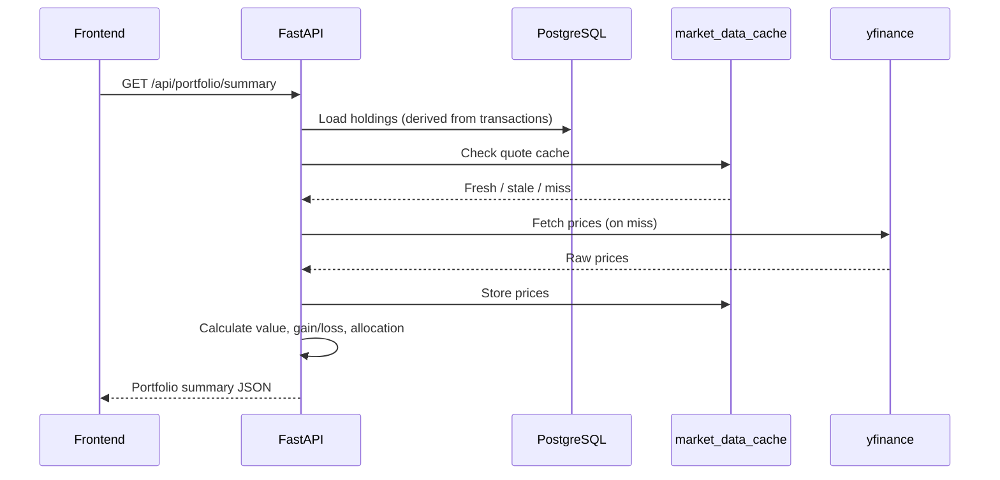
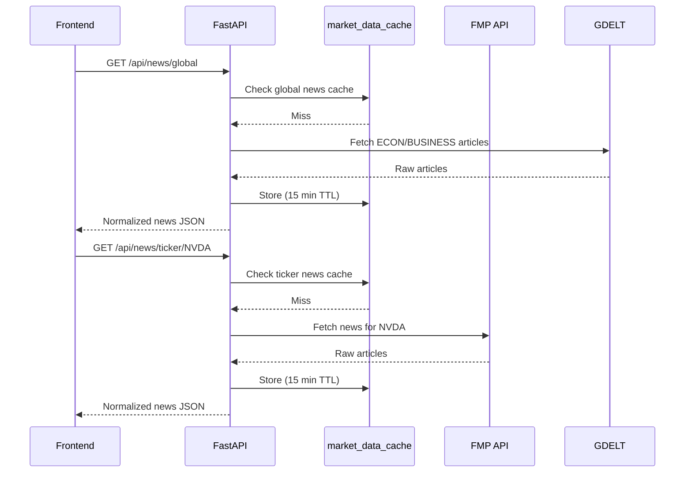

# AssetFlow Mini Architecture

## Purpose

AssetFlow Mini is a full-stack portfolio dashboard and quantitative analysis tool.

It serves two purposes:
1. **GitHub showcase** — demonstrating full-stack engineering depth and quantitative analysis skills
2. **Personal portfolio tool** — real holdings tracking, market data, and stock research

The architecture should stay simple until the core product works end to end:

- React/Vite frontend displays portfolio, analytics, watchlist, screener, news, and AI summary views.
- FastAPI backend owns API contracts, validation, calculations, and external service wrappers.
- PostgreSQL (via Docker) stores portfolio state.
- External services provide market data and news.
- Ollama provides local AI narrative summaries.

Advanced AI infrastructure (Hermes Agent, MCP, LangGraph, pgvector, LiteLLM) is intentionally out of scope.

---

## Current State

Phase 2 complete. Phase 3 next.

```text
assetflow-mini/
|-- backend/
|   |-- app/
|   |   |-- main.py
|   |   |-- seeds.py
|   |   |-- api/
|   |   |   |-- routes_health.py
|   |   |   `-- routes_portfolio.py
|   |   |-- schemas/
|   |   |   `-- portfolio.py
|   |   `-- services/
|   |       `-- portfolio_service.py
|   |-- tests/
|   |-- pyproject.toml
|   `-- uv.lock
|-- frontend/
|   `-- src/
|-- docs/
|   |-- architecture.md
|   `-- roadmap.md
`-- README.md
```

Current endpoints:

```text
GET /health
GET /api/portfolio/summary
```

---

## Target Architecture



Core rule:

```text
Frontend displays data.
Backend owns logic.
Database stores portfolio state.
External services provide market/news data.
Analytics service owns all quant calculations.
AI explains backend-provided data.
```

---

## Backend Layers

| Layer | Responsibility | Status |
|---|---|---|
| Routes | HTTP endpoints, response models | health + portfolio (Phase 2) |
| Schemas | Pydantic request/response contracts | portfolio (Phase 2) |
| Services | Business logic, external wrappers, quant calculations | portfolio_service (Phase 2) |
| Models | SQLAlchemy database tables | Phase 3 |
| Core | Config, DB session, shared settings | Phase 3 |
| Seeds | Temporary demo data before database | Phase 2 (replaced in Phase 3) |

Route handlers stay thin. Business logic belongs in services.

---

## Data Sources

| Purpose | Source | Notes |
|---|---|---|
| Stock prices, history, fundamentals | yfinance | Free, no API key |
| Stock screener | FMP free tier | 250 calls/day, API key via `.env` |
| Portfolio news + ticker news | FMP free tier | Batched ticker requests |
| Global macro / economy news | GDELT | Free, unlimited, filtered to ECON/BUSINESS themes |
| AI summaries | Ollama (local) | Phase 9, llama3.2 default |

---

## Database Schema

### portfolios

| Field | Type | Notes |
|---|---|---|
| `id` | UUID | Primary key |
| `name` | string | Display name |
| `currency` | string | e.g. `USD` |
| `created_at` | datetime | |
| `updated_at` | datetime | |

### transactions

Source of truth for holdings. Holdings are derived from transaction history.

| Field | Type | Notes |
|---|---|---|
| `id` | UUID | Primary key |
| `portfolio_id` | UUID FK | |
| `symbol` | string | Ticker |
| `company_name` | string | Display name |
| `transaction_type` | enum | `BUY` / `SELL` |
| `shares` | decimal | |
| `price_per_share` | decimal | |
| `fees` | decimal | Optional |
| `transacted_at` | datetime | Trade date |
| `created_at` | datetime | |

### watchlist_items

| Field | Type | Notes |
|---|---|---|
| `id` | UUID | Primary key |
| `symbol` | string | Ticker |
| `company_name` | string | |
| `target_price` | decimal, nullable | |
| `currency` | string | |
| `note` | string, nullable | |
| `created_at` | datetime | |
| `updated_at` | datetime | |

### market_data_cache

DB-backed cache for all external API responses.

| Field | Type | Notes |
|---|---|---|
| `id` | UUID | Primary key |
| `symbol` | string, nullable | Ticker (null for non-ticker data) |
| `data_type` | string | e.g. `quote`, `history_1d`, `fundamentals`, `news_ticker`, `screener` |
| `payload` | JSON | Raw normalized response |
| `fetched_at` | datetime | Used for TTL checks |

Cache TTLs:

| data_type | TTL |
|---|---|
| `quote` | 5 minutes |
| `history_*` | 1 hour |
| `fundamentals` | 24 hours |
| `news_*` | 15 minutes |
| `screener` | 1 hour |

---

## API Contract

The frontend expects camelCase JSON. Preserve this when replacing seed data with database data.

Current portfolio summary response shape:

```json
{
  "totalValue": 14800.0,
  "totalCost": 13100.0,
  "unrealizedPl": 1700.0,
  "unrealizedPlPct": 12.98,
  "portfolios": [
    {
      "id": "port-1",
      "name": "US Tech",
      "value": 14800.0,
      "cost": 13100.0,
      "gainLoss": 1700.0,
      "gainLossPct": 12.98,
      "holdings": 3,
      "currency": "USD"
    }
  ],
  "holdings": [
    {
      "symbol": "NVDA",
      "name": "NVIDIA Corporation",
      "shares": 10.0,
      "avgPrice": 400.0,
      "currentPrice": 480.0,
      "marketValue": 4800.0,
      "gainLoss": 800.0,
      "gainLossPct": 20.0,
      "sector": "Technology",
      "portfolioId": "port-1"
    }
  ]
}
```

Contract rules:
- All JSON fields use camelCase.
- Money fields are numeric (float), not strings.
- Use Decimal arithmetic internally; serialize to float at the boundary.
- Do not expose database internals directly as API fields.

---

## Quantitative Analytics

### analytics_service.py

All quant calculations live in `backend/app/services/analytics_service.py`. Dependencies: `numpy`, `scipy`, `pandas` (added Phase 5).

### Analytics split

**Portfolio Detail screen (quick metrics):**
- Sharpe ratio
- Annualised volatility
- Max drawdown
- Beta (vs S&P 500)
- Correlation matrix heatmap of holdings

**Analytics screen (dedicated, heavy tools):**
- Monte Carlo simulation — projection chart with confidence intervals, configurable time horizon
- Efficient Frontier — interactive chart with current portfolio plotted, optimal portfolio marked
- Value at Risk (VaR, 95%) — single number with plain-English explanation

### Testing

- All services: happy path + edge cases (zero positions, single asset, negative returns)
- `analytics_service.py` specifically: statistical validation — Monte Carlo results within expected bounds, Efficient Frontier produces valid convex curve

---

## Caching

### Pattern: Database-as-Cache

Before calling any external API, check `market_data_cache` for a record within the TTL. If fresh, return it. If stale or missing, call the external API, store the result, and return it.

### Error handling for stale/missing cache

```text
Fresh cache exists     → return cache data
Stale cache + API ok   → fetch, update cache, return fresh data
Stale cache + API fail → return stale data with "stale": true flag
No cache + API fail    → return proper error response
```

The `"stale": true` flag lets the frontend show a subtle "data may be delayed" indicator without crashing.

### Future

Redis is planned for the full AssetFlow product as an L1 cache layer in front of the DB cache. The pattern is identical — Redis just becomes a faster lookup before the DB check.

---

## Error Handling

| Situation | Expected behavior |
|---|---|
| Backend offline | Frontend shows friendly error |
| Database unavailable | Backend returns clear error |
| Invalid ticker | API returns validation error |
| yfinance unavailable + stale cache | Return stale data with `"stale": true` |
| yfinance unavailable + no cache | Return error |
| FMP rate limit hit | Return stale cache or error |
| No news found | Frontend shows empty news state |
| Ollama unavailable | AI card shows fallback message |
| Empty portfolio | Dashboard shows empty state |

One failing external service must not crash the whole app.

---

## News Architecture

Three tabs, two sources:

```text
Global macro tab  → GDELT (filtered: ECON, BUSINESS themes, major outlets)
Portfolio tab     → FMP /stock_news?tickers=AAPL,NVDA,... (batched)
Ticker tab        → FMP /stock_news?tickers=SYMBOL
```

Endpoints:

```text
GET /api/news/global
GET /api/news/portfolio/{portfolio_id}
GET /api/news/ticker/{symbol}
```

---

## AI Architecture

- Ollama runs locally. Backend calls it via HTTP.
- Default model: `llama3.2`. Configurable via `OLLAMA_MODEL` env var.
- All AI endpoints receive structured backend data as context — the model never invents data.
- Narrative output only — no AI-generated scores, prices, or ratings.
- If Ollama is unavailable, return a graceful fallback (not an error).

Endpoints:

```text
POST /api/ai/portfolio-summary   ← pass holdings, weights, P&L
POST /api/ai/stock-note          ← pass fundamentals + recent news headlines
POST /api/ai/news-digest         ← pass recent news articles
```

---

## Data Flows

### Future Portfolio Summary (Phase 4+)



### Future News (Phase 6)



---

## Local Development

Phase 2 (current):

```bash
cd backend
uv run uvicorn app.main:app --reload
uv run pytest
```

```bash
cd frontend
npm install
npm run dev
```

Phase 3+ (with database):

```bash
docker compose up -d
cd backend
uv run alembic upgrade head
uv run python -m app.scripts.seed
uv run uvicorn app.main:app --reload
```

Open:

```text
http://127.0.0.1:8000/health
http://127.0.0.1:8000/docs
http://localhost:5173
```

---

## Next Step

Phase 3: Database and Models.

Tasks:
- Add `docker-compose.yml` for PostgreSQL.
- Add `DATABASE_URL` to backend config.
- Add SQLAlchemy session setup.
- Add models: `portfolios`, `transactions`, `watchlist_items`, `market_data_cache`.
- Add Alembic and first migration.
- Add seed script from `seeds.py`.
- Keep `GET /api/portfolio/summary` response shape unchanged.
