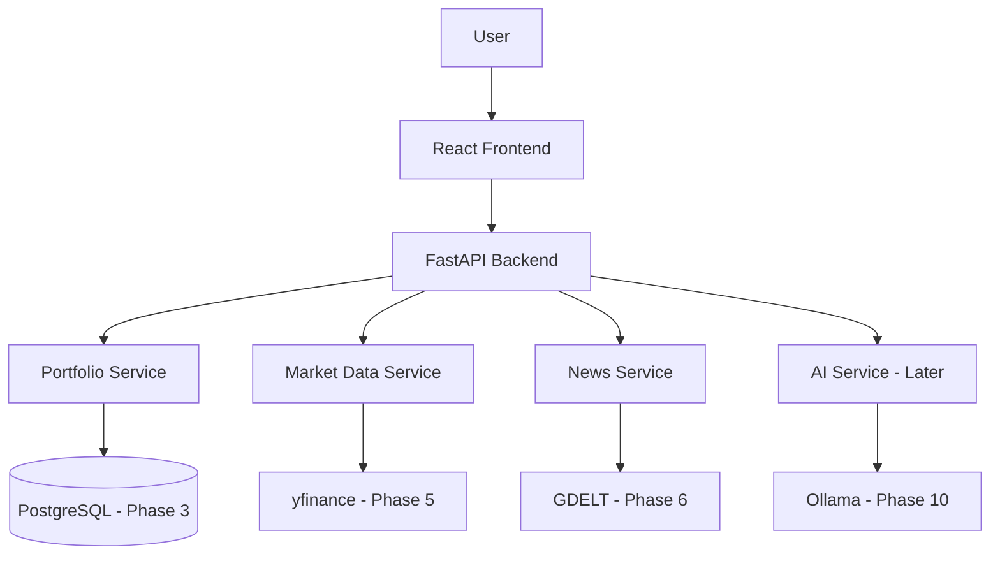
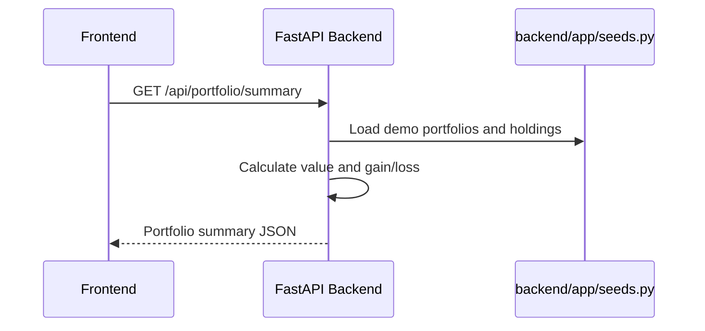
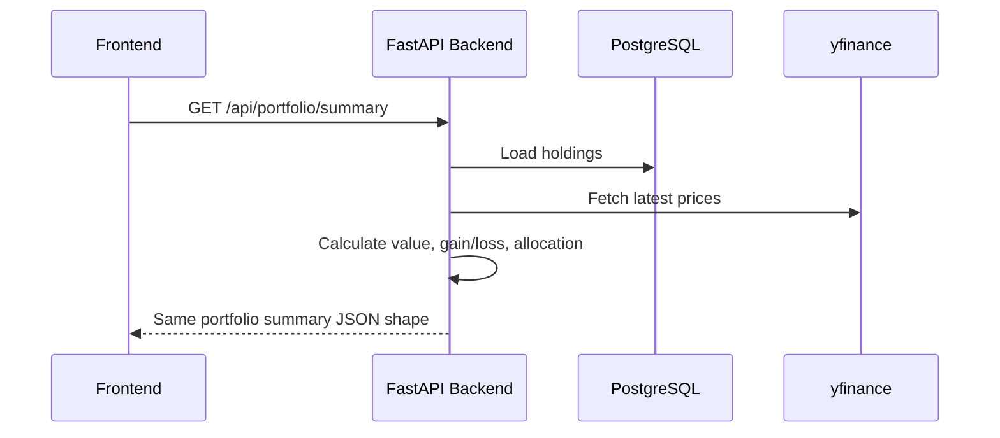
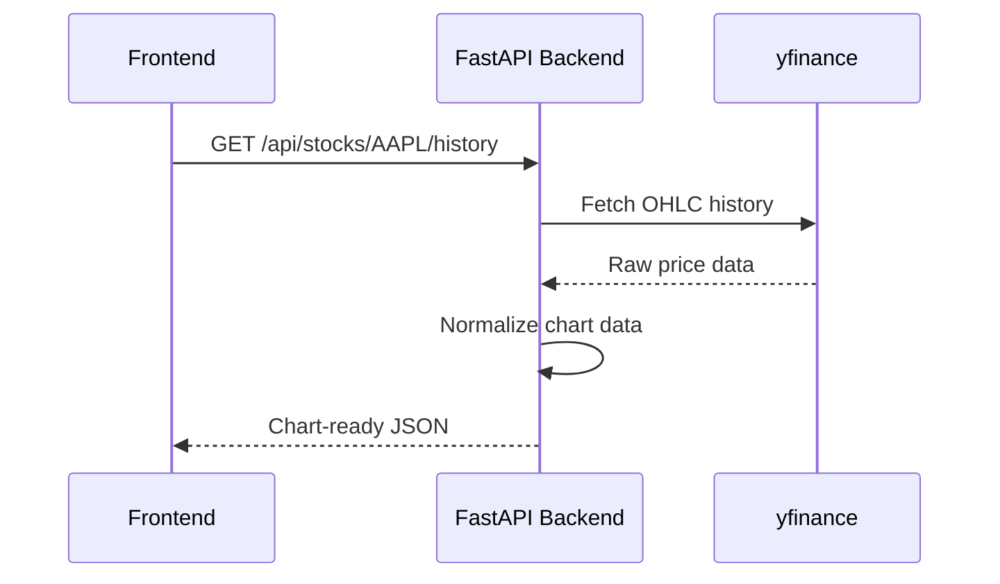
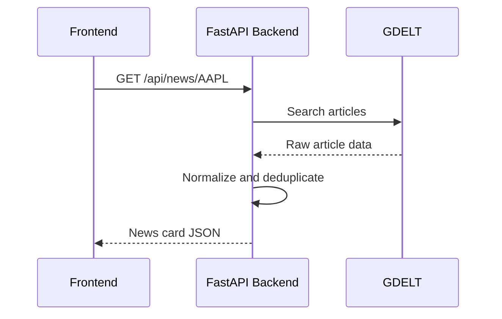
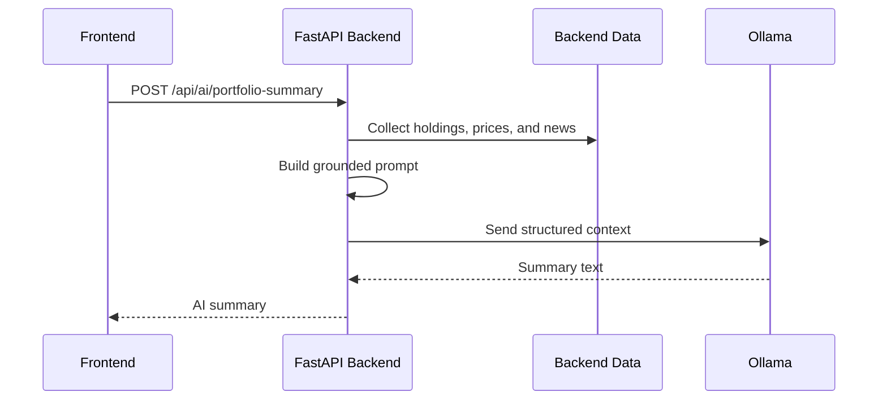

# AssetFlow Mini Architecture

## Purpose

AssetFlow Mini is a full-stack portfolio dashboard and stock analysis app.

The architecture should stay simple until the core product works end to end:

- React/Vite frontend displays portfolio, watchlist, stock, news, and AI summary views.
- FastAPI backend owns API contracts, validation, and portfolio calculations.
- Current Phase 2 data comes from backend seed files.
- Phase 3 moves persistent portfolio and watchlist state into PostgreSQL.
- Later phases add market data, news, and local AI summaries behind backend services.

Advanced AI infrastructure such as Hermes Agent, MCP, LangGraph, pgvector, and LiteLLM is intentionally out of scope until the normal app is stable.

## Current State

The repo currently has:

```text
assetflow-mini/
|-- backend/
|   |-- app/
|   |   |-- main.py
|   |   |-- seeds.py
|   |   |-- api/
|   |   |   |-- routes_health.py
|   |   |   `-- routes_portfolio.py
|   |   |-- schemas/
|   |   |   `-- portfolio.py
|   |   `-- services/
|   |       `-- portfolio_service.py
|   |-- tests/
|   |-- pyproject.toml
|   `-- uv.lock
|-- frontend/
|   `-- src/
|-- docs/
|   |-- architecture.md
|   `-- roadmap.md
`-- README.md
```

Current backend endpoints:

```text
GET /health
GET /api/portfolio/summary
```

Current backend behavior:

- Loads demo portfolios and holdings from `backend/app/seeds.py`.
- Calculates market value, cost basis, and unrealized gain/loss.
- Uses `Decimal` internally for money calculations.
- Returns frontend-friendly camelCase JSON.
- Restricts CORS to the local Vite origins.

## Target Shape

The intended MVP architecture is:



Core rule:

```text
Frontend displays data.
Backend owns logic.
Database stores portfolio state.
External services provide market/news data.
AI explains backend-provided data later.
```

## Backend Layers

Keep the backend layered, but do not add files before they are useful.

| Layer | Responsibility | Current status |
|---|---|---|
| Routes | HTTP endpoints and response models | Exists for health and portfolio summary |
| Schemas | Pydantic request/response contracts | Exists for portfolio summary |
| Services | Portfolio calculations and external service wrappers | Portfolio service exists |
| Seeds | Temporary demo data before database | Exists |
| Models | SQLAlchemy database tables | Phase 3 |
| Core | Config, database session, shared settings | Phase 3 |

Route handlers should stay thin. Business logic belongs in services.

## API Contract

The frontend expects camelCase JSON. Preserve this response shape when replacing seed data with database data.

Current portfolio summary response:

```json
{
  "totalValue": 14800.0,
  "totalCost": 13100.0,
  "unrealizedPl": 1700.0,
  "unrealizedPlPct": 12.98,
  "portfolios": [
    {
      "id": "port-1",
      "name": "US Tech",
      "value": 14800.0,
      "cost": 13100.0,
      "gainLoss": 1700.0,
      "gainLossPct": 12.98,
      "holdings": 3,
      "currency": "USD"
    }
  ],
  "holdings": [
    {
      "symbol": "NVDA",
      "name": "NVIDIA Corporation",
      "shares": 10.0,
      "avgPrice": 400.0,
      "currentPrice": 480.0,
      "marketValue": 4800.0,
      "gainLoss": 800.0,
      "gainLossPct": 20.0,
      "sector": "Technology",
      "portfolioId": "port-1"
    }
  ]
}
```

Important contract decisions:

- Keep public JSON fields camelCase.
- Keep portfolio count as `holdings`, not `holdingsCount`, because the current frontend uses `p.holdings`.
- Keep money fields numeric in JSON.
- Use exact decimal arithmetic inside the backend, then serialize final values.
- Do not expose database internals directly as API fields.

## Canonical Demo Data

The current backend seed is the canonical Phase 2 dataset:

```text
US Tech:
- NVDA
- AAPL
- MSFT

Global Dividend:
- JNJ
- VZ
- KO
```

The frontend still contains richer imported mock data for the visual prototype. When the frontend is wired to the backend, either:

1. Replace the frontend mock portfolio data with API data, or
2. Add a small frontend adapter that maps API data into the current component shape.

Avoid maintaining multiple unrelated demo universes long term.

## Database Plan

Database work starts in Phase 3. Phase 2 should remain seed-backed.

Initial tables:

```text
holdings
watchlist_items
```

Optional later table:

```text
transactions
```

### holdings

| Field | Type | Notes |
|---|---|---|
| `id` | UUID or integer | Primary key |
| `portfolio_id` | string or FK | Portfolio grouping |
| `symbol` | string | Ticker, for example `AAPL` |
| `company_name` | string | Display name |
| `shares` | decimal | Number of shares |
| `average_buy_price` | decimal | Cost basis per share |
| `currency` | string | Example: `USD` |
| `sector` | string | Optional classification |
| `country` | string | Optional classification |
| `created_at` | datetime | Creation timestamp |
| `updated_at` | datetime | Last update timestamp |

### watchlist_items

| Field | Type | Notes |
|---|---|---|
| `id` | UUID or integer | Primary key |
| `symbol` | string | Ticker |
| `company_name` | string | Display name |
| `target_price` | decimal, nullable | Optional target price |
| `currency` | string | Example: `USD` |
| `note` | string, nullable | Optional note |
| `created_at` | datetime | Creation timestamp |
| `updated_at` | datetime | Last update timestamp |

Transactions should wait until the app needs transaction-derived cost basis.

## Data Flows

### Current Portfolio Summary



### Future Portfolio Summary



### Future Market Data



### Future News



### Future AI



AI rule:

```text
Real data first. AI explanation second.
```

The AI model must not invent prices, financial metrics, news articles, analyst ratings, buy/sell recommendations, or user-specific financial advice.

## Caching

External data calls should be cached once yfinance and GDELT are added.

Initial approach:

```text
In-memory TTL cache
```

Suggested cache windows:

| Data | Cache duration |
|---|---|
| Current quote | 1-5 minutes |
| Historical daily candles | 1-24 hours |
| News search | 15-60 minutes |
| AI summary | Optional, later |

Database-backed caching can wait.

## Error Handling

The app should degrade gracefully.

| Situation | Expected behavior |
|---|---|
| Backend offline | Frontend shows a friendly error |
| Database unavailable | Backend returns a clear error |
| Invalid ticker | API returns a useful validation error |
| yfinance unavailable | Stock cards show fallback state |
| No news found | Frontend shows an empty news state |
| Ollama unavailable | AI card shows fallback message |
| Empty portfolio | Dashboard shows empty state |

One failing external service should not crash the whole app.

## Testing

Current backend tests should cover:

- Health endpoint
- Portfolio summary endpoint
- JSON field names
- Market value calculation
- Gain/loss calculation
- Percentage calculation
- Decimal rounding edge cases

Future tests should add:

- Database model persistence
- Empty portfolio behavior
- Invalid ticker behavior
- Mocked yfinance responses
- Mocked GDELT responses
- AI unavailable fallback

## Local Development

Current Phase 2 backend:

```bash
cd backend
uv run uvicorn app.main:app --reload
uv run pytest
```

Current frontend:

```bash
cd frontend
npm install
npm run dev
```

Open:

```text
http://127.0.0.1:8000/health
http://127.0.0.1:8000/docs
http://localhost:5173
```

Phase 3 database setup will add commands like:

```bash
docker compose up -d
cd backend
uv run alembic upgrade head
uv run python -m app.scripts.seed
```

Do not add these commands to the main setup path until the files exist.

## Next Architecture Step

The next implementation stage is Phase 3: database and models.

Tasks:

- Add `docker-compose.yml` for PostgreSQL.
- Add backend configuration for `DATABASE_URL`.
- Add SQLAlchemy database/session setup.
- Add holdings and watchlist models.
- Add Alembic and first migration.
- Move seed data from `backend/app/seeds.py` into a seed script.
- Keep `GET /api/portfolio/summary` response shape stable.

Do not add market data, news, AI, authentication, broker import, MCP, Hermes Agent, or LangGraph in Phase 3.
